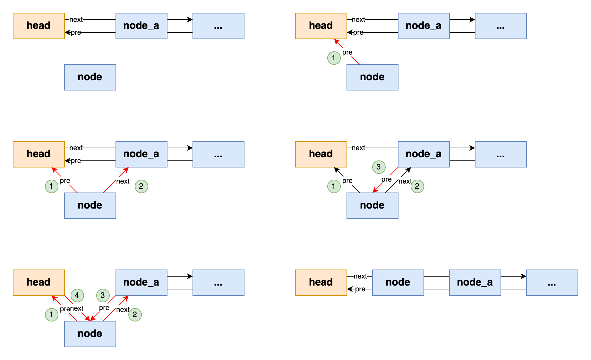

# 双向链表

## 1.结构定义

双向链表节点的一般包括`pre`和`next`指针，分别指向节点的上一个节点和下一个节点。

双向链表一般包含`head`和`tail`两个伪节点，以及`size`表示链表中节点的个数。

```go
type (
	// DoubleListNode define
	DoubleListNode struct {
		val       int
		pre, next *DoubleListNode
	}
	// DoubleLinkedList define
	DoubleLinkedList struct {
		size       int
		head, tail *DoubleListNode
	}
)
```


**初始化**

```go
func NewDoubleLinkedList() *DoubleLinkedList {
	list := &DoubleLinkedList{
		size: 0,
		head: &DoubleListNode{},
		tail: &DoubleListNode{},
	}
	list.head.next = list.tail
	list.tail.pre = list.head
	return list
}
```


## 2.双向链表的操作

```go
// AddFront define
func (l *DoubleLinkedList) AddFront(node *DoubleListNode) {
	node.pre = l.head
	node.next = l.head.next
	l.head.next.pre = node
	l.head.next = node
	l.size++
}

// AddRear define
func (l *DoubleLinkedList) AddRear(node *DoubleListNode) {
	node.pre = l.tail.pre
	node.next = l.tail
	l.tail.pre.next = node
	l.tail.pre = node
	l.size++
}

// RemoveFront define
func (l *DoubleLinkedList) RemoveFront() *DoubleListNode {
	if l.size > 0 {
		node := l.head.next
		l.removeNode(node)
		return node
	}
	return nil
}

// RemoveRear define
func (l *DoubleLinkedList) RemoveRear() *DoubleListNode {
	if l.size > 0 {
		node := l.tail.pre
		l.removeNode(node)
		return node
	}
	return nil
}

// removeNode define
func (l *DoubleLinkedList) removeNode(node *DoubleListNode) {
	node.pre.next = node.next
	node.next.pre = node.pre
	l.size--
}

// Len define
func (l *DoubleLinkedList) Len() int {
	return l.size
}
```





