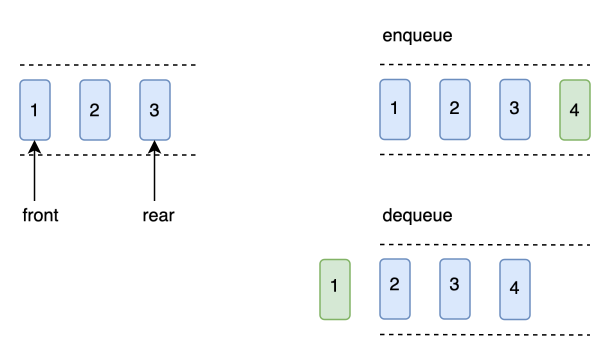

# Queue

## 1.基本定义

队列实现的是一种先进先出（FIFO）策略的线性表。

队列有队头(head)和队尾(tail)，当有一个元素入队时，放入队尾；出队时，即取出队头元素。



基本操作包括：

  + push(x)：将元素x加入到队列的尾部
  + pop()：弹出队列的第一个元素，但是，**不会返回被弹元素的值**
  + front()：返回队首元素
  + back()：返回队尾元素
  + empty()：判断队列是否为空，当队列为空时，返回true
  + size()：返回队列中的元素个数


## 2.队列的实现

从时间复杂度角度来说，`Enqueue`，`Dequeue`，`Front`和`Back`，`Empty`操作只需要O(1)的时间。从实现角度而言，队列的实现方式有两种，**数组和线性表**。

下面以数组为例进行实现：

```go
type (
	// Queue define
	// a basic queue
	Queue struct {
		val []int
	}
)

// NewQueue define
func NewQueue() *Queue {
	return &Queue{
		val: make([]int, 0, 1024),
	}
}

// Enqueue define
func (q *Queue) Enqueue(x int) {
	q.val = append(q.val, x)
}

// Dequeue define
func (q *Queue) Dequeue() {
	if !q.Empty() {
		q.val = q.val[1:]
	}
}

// Front define
func (q *Queue) Front() int {
	if q.Empty() {
		return -1
	}
	return q.val[0]
}

// Back define
func (q *Queue) Back() int {
	if q.Empty() {
		return -1
	}
	return q.val[q.Size()-1]
}

// Empty define
func (q *Queue) Empty() bool {
	return len(q.val) == 0
}

// Size define
func (q *Queue) Size() int {
	return len(q.val)
}

```


## 3.相关题目

队列和栈通常一块出现，这类的经典题目有两个：

- [225 用队列实现栈](./No.225_用队列实现栈.md)
- [232 用栈实现队列](./No.232_用栈实现队列.md)
