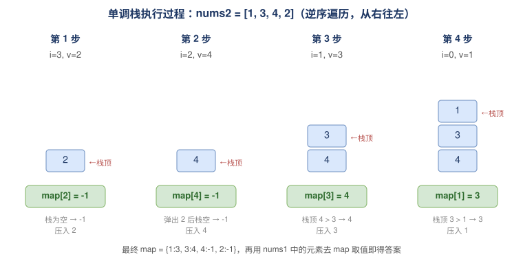

## 496 下一个更大元素1-简单

题目：

`nums1` 中数字 `x` 的 **下一个更大元素** 是指 `x` 在 `nums2` 中对应位置 **右侧** 的 **第一个** 比 `x` 大的元素。

给你两个 **没有重复元素** 的数组 `nums1` 和 `nums2` ，下标从 **0** 开始计数，其中`nums1` 是 `nums2` 的子集。

对于每个 `0 <= i < nums1.length` ，找出满足 `nums1[i] == nums2[j]` 的下标 `j` ，并且在 `nums2` 确定 `nums2[j]` 的 **下一个更大元素** 。如果不存在下一个更大元素，那么本次查询的答案是 `-1` 。

返回一个长度为 `nums1.length` 的数组 `ans` 作为答案，满足 `ans[i]` 是如上所述的 **下一个更大元素** 。


> **示例 1：**
>
> ```
> 输入：nums1 = [4,1,2], nums2 = [1,3,4,2].
> 输出：[-1,3,-1]
> 解释：nums1 中每个值的下一个更大元素如下所述：
> - 4 ，用加粗斜体标识，nums2 = [1,3,4,2]。不存在下一个更大元素，所以答案是 -1 。
> - 1 ，用加粗斜体标识，nums2 = [1,3,4,2]。下一个更大元素是 3 。
> - 2 ，用加粗斜体标识，nums2 = [1,3,4,2]。不存在下一个更大元素，所以答案是 -1 。
> ```
>
> **示例 2：**
>
> ```
> 输入：nums1 = [2,4], nums2 = [1,2,3,4].
> 输出：[3,-1]
> 解释：nums1 中每个值的下一个更大元素如下所述：
> - 2 ，用加粗斜体标识，nums2 = [1,2,3,4]。下一个更大元素是 3 。
> - 4 ，用加粗斜体标识，nums2 = [1,2,3,4]。不存在下一个更大元素，所以答案是 -1 。
> ```


分析：

下一个更大的元素是指右侧第一个比 x 大的元素，所以可以逆序遍历，使用单调栈保存下一个更大的元素。

遍历的时候，如果单调栈不为空，依次弹出栈顶元素。

此后，如果栈不为空，那么栈顶元素就是下一个更大的元素，否则就是 -1。

因为题目中表明数组的中的元素互不相同，可用 map 存储结果，方便 num1 检索。

```go
// date 2023/12/18
func nextGreaterElement(nums1 []int, nums2 []int) []int {
    set := make(map[int]int, 16)

    // 寻找右侧 第一个 比 x 大的元素
    // 逆序遍历，单调栈保存右侧第一个比x大的元素
    stack := make([]int, 0, 16)
    for i := len(nums2)-1; i >= 0; i-- {
        v := nums2[i]
        for len(stack) > 0 && v >= stack[len(stack)-1] {
            stack = stack[:len(stack)-1]
        }
        if len(stack) == 0 {
            set[v] = -1
        } else {
            set[v] = stack[len(stack)-1]
        }
        stack = append(stack, v)
    }
    ans := make([]int, len(nums1))
    for i, v1 := range nums1 {
        res, ok := set[v1]
        if ok {
            ans[i] = res
        } else {
            ans[i] = -1
        }
    }

    return ans
}
```

### 图解：单调栈执行过程

以 `nums2 = [1,3,4,2]` 为例，逆序遍历时单调栈的变化（栈从底向上画，栈顶在上方；蓝色为栈中元素，绿色为当前元素记录到的答案）：



最终得到 `map = {1:3, 3:4, 4:-1, 2:-1}`，再依次用 `nums1` 中的元素去 map 里取值即可。

### 写法二：正序遍历（对比）

正序遍历也能做，思路反过来：维护一个**单调递减栈**存放「还没找到下一个更大元素的值」。遍历到的新元素 `v` 一旦比栈顶大，它就是栈顶那些元素的下一个更大元素——把它们逐个弹出并记录答案。

```go
// date 2026/06/21
// 正序写法：遇到更大的元素，就把它作为栈顶元素的「下一个更大元素」
func nextGreaterElementForward(nums1 []int, nums2 []int) []int {
    // 单调递减栈：存放尚未找到下一个更大元素的值
    stack := make([]int, 0, 16)
    // next[v] = v 在 nums2 中的下一个更大元素
    next := make(map[int]int, 16)

    for _, v := range nums2 {
        // v 比栈顶大 → v 是栈顶这些元素的下一个更大元素
        for len(stack) > 0 && v > stack[len(stack)-1] {
            top := stack[len(stack)-1]
            stack = stack[:len(stack)-1]
            next[top] = v
        }
        stack = append(stack, v)
    }
    // 栈中剩余的元素都没有下一个更大元素
    for len(stack) > 0 {
        next[stack[len(stack)-1]] = -1
        stack = stack[:len(stack)-1]
    }

    ans := make([]int, len(nums1))
    for i, v := range nums1 {
        ans[i] = next[v] // nums1 是 nums2 的子集，next[v] 必然存在
    }
    return ans
}
```

两种写法复杂度相同，均为 O(n + m) 时间、O(n) 空间。区别只在于「方向」：

- **逆序**：先看右边有什么（栈里装的就是答案候选），贴合「右侧第一个更大」的直觉；
- **正序**：右边来了一个更大的，回头给左边结算，更接近「事件驱动」的思路（后续 [No.503 下一个更大元素 II](./No.503_下一个更大的元素2.md) 也常用这种写法）。

