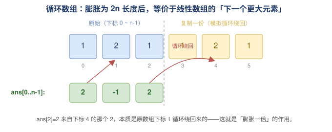

## 503 下一个更大的元素2-中等

题目：

给定一个循环数组 `nums` （ `nums[nums.length - 1]` 的下一个元素是 `nums[0]` ），返回 *`nums` 中每个元素的 **下一个更大元素*** 。

数字 `x` 的 **下一个更大的元素** 是按数组遍历顺序，这个数字之后的第一个比它更大的数，这意味着你应该循环地搜索它的下一个更大的数。如果不存在，则输出 `-1` 。


> **示例 1:**
>
> ```
> 输入: nums = [1,2,1]
> 输出: [2,-1,2]
> 解释: 第一个 1 的下一个更大的数是 2；
> 数字 2 找不到下一个更大的数； 
> 第二个 1 的下一个最大的数需要循环搜索，结果也是 2。
> ```
>
> **示例 2:**
>
> ```
> 输入: nums = [1,2,3,4,3]
> 输出: [2,3,4,-1,4]
> ```


分析：

输入为循环数组，所以考虑把数组膨胀1倍，然后逆序遍历，求新数组的下一个更大元素。然后只返回结果集的前一半。

```go
// date 2023/12/18
func nextGreaterElements(nums []int) []int {
    n := len(nums)
    nums2 := make([]int, 2*n, 2*n)
    for i, v := range nums {
        nums2[i] = v
        nums2[n+i] = v
    }
    stack := make([]int, 0, 16)
    ans := make([]int, 2*n)
    for i := len(nums2)-1; i >= 0; i-- {
        v := nums2[i]
        for len(stack) > 0 && v >= stack[len(stack)-1] {
            stack = stack[:len(stack)-1]
        }
        if len(stack) > 0 {
            ans[i] = stack[len(stack)-1]
        } else {
            ans[i] = -1
        }
        stack = append(stack, v)
    }

    ans = ans[:n]
    return ans
}
```

### 图解：循环数组如何线性化

「循环」带来的难点是：某个元素的下一个更大元素可能在它**前面**（绕一圈回来）。把数组**膨胀一倍**，就把「绕回」变成了普通的「往右找」，于是退化成 [No.496](./No.496_下一个更大的元素1.md) 的单调栈问题，最后只取前 `n` 个结果。

以 `nums = [1,2,1]` 为例（蓝色为原始，黄色为复制的一份；绿色为答案，红色箭头指向答案对应的更大元素）：



注意 `ans[2]=2` 找到的是下标 `4` 的那个 `2`——它本质是原数组下标 `1` 循环绕回来的，这正是「膨胀一倍」的作用。

### 写法二：下标栈 + 取模（无需真正膨胀数组）

上面的写法真的开了一个 `2n` 的数组。其实不必：只要**遍历两圈**，用 `i % n` 访问元素即可。同时把栈改成**存下标**（而非值），用「正序事件驱动」的方式结算——这也是「下一个更大元素」系列里更通用的写法。

```go
// date 2026/06/21
// 写法二：单调栈存「下标」，遍历 2n 次，用 i%n 取元素，省去真正膨胀数组
func nextGreaterElements(nums []int) []int {
    n := len(nums)
    ans := make([]int, n)
    for i := range ans {
        ans[i] = -1
    }
    stack := make([]int, 0, n) // 存「下标」，对应值从栈底到栈顶单调递减
    // 遍历两圈：第一圈入栈找答案，第二圈回头给「跨过末尾」的元素结算
    for i := 0; i < 2*n; i++ {
        idx := i % n
        for len(stack) > 0 && nums[idx] > nums[stack[len(stack)-1]] {
            ans[stack[len(stack)-1]] = nums[idx]
            stack = stack[:len(stack)-1]
        }
        // 只有第一圈需要入栈，第二圈只是回头结算，不再重复入栈
        if i < n {
            stack = append(stack, idx)
        }
    }
    return ans
}
```

两种写法复杂度相同，均为 O(n) 时间、O(n) 空间。区别在于：

- **写法一（膨胀数组 + 逆序）**：直观，但额外开了 `2n` 的数组；
- **写法二（下标栈 + 取模）**：不开 `2n` 数组，栈存下标，是单调栈类题目（如「每日温度」「柱状图最大矩形」）更通用的范式。

关键点：`i < n` 才入栈——第二圈不再重复入栈，否则栈里会混入重复下标，导致重复结算。

### 写法三：取模 + 逆序值栈（社区推荐）

把写法一和写法二折中一下：**不开 `2n` 数组**（用取模），同时**回到逆序值栈**。这样比写法二更干净——没有「`i<n` 才入栈」的特判，改成「`i<n` 才写答案」，思路更顺：

```go
// date 2026/06/21
// 写法三：取模 + 逆序值栈（无需膨胀数组，也无需下标栈特判）
func nextGreaterElements(nums []int) []int {
    n := len(nums)
    res := make([]int, n)
    stack := make([]int, 0, n)
    for i := 2*n - 1; i >= 0; i-- {
        v := nums[i%n]
        for len(stack) > 0 && stack[len(stack)-1] <= v { // 等于也要弹，保证找的是「严格更大」
            stack = stack[:len(stack)-1]
        }
        if i < n { // 只有前 n 个位置才需要写答案
            if len(stack) > 0 {
                res[i] = stack[len(stack)-1]
            } else {
                res[i] = -1
            }
        }
        stack = append(stack, v) // 每次都压栈，第二圈压入的值正好留给第一圈用
    }
    return res
}
```

### 三种写法对比

三者复杂度相同，均为 O(n) 时间、O(n) 空间，纯属风格差异：

| 写法 | 是否开 `2n` 数组 | 栈内容 | 方向 | 特判 |
|------|:---:|:---:|:---:|------|
| 一（膨胀 + 逆序） | ✅ | 值 | 逆序 | 无 |
| 二（取模 + 正序） | ❌ | 下标 | 正序 | `i<n` 才入栈 |
| 三（取模 + 逆序） | ❌ | 值 | 逆序 | `i<n` 才写结果 |

### 易错点：503 允许重复元素，弹栈条件要用 `<=`

这是 503 和 [496](./No.496_下一个更大的元素1.md) 的一个关键区别——496 保证元素互不相同，而 **503 的数组可能有重复值**。我们要找的是「严格更大」，所以**相等的元素不能作为答案**，弹栈时必须把等于当前值的元素也弹掉：

- 写法一用 `v >= 栈顶`（大于等于就弹）；
- 写法三用 `栈顶 <= v`（同理）；
- 写法二反着来，用 `nums[idx] > 栈顶` 才结算（严格大于才结算），等价。

如果这里写成严格不等号（只弹严格更小的），遇到相等的元素会留在栈里，导致把「相等」误判成「更大」。

