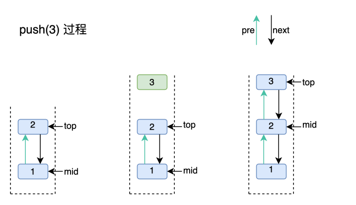
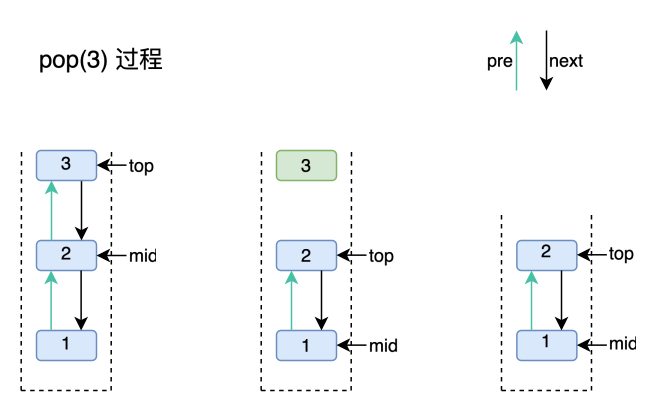
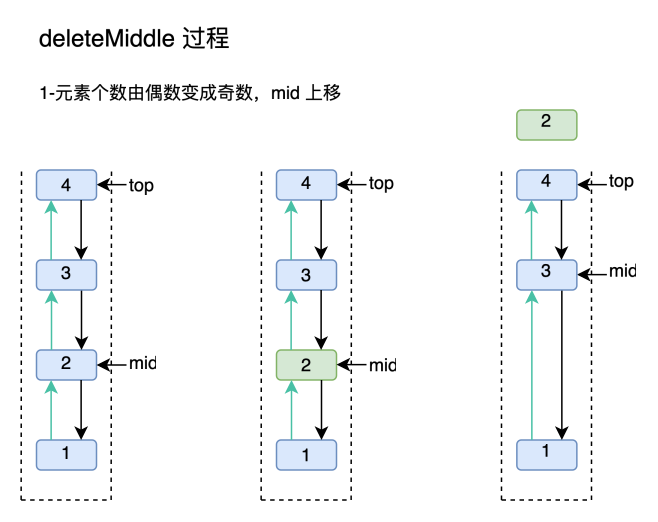
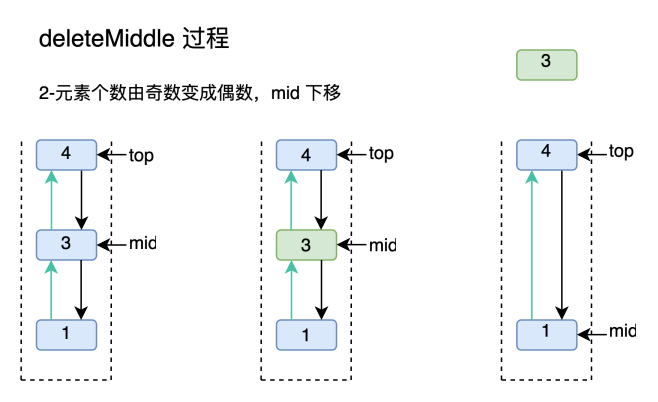

# Middle Stack

设计并实现一种特殊栈结构，具有以下四种操作，且四种操作的时间复杂度均为O(1)。

1) Push() which adds an element to the top of stack.
2) Pop() which removes an element from top of stack.
3) GetMiddle() which will return middle element of the stack.
4) DeleteMiddle() which will delete the middle element.


思路分析：

栈的底层实现是利用数组或线性表来进行构建的。对于Push(),Pop()和GetMiddle()操作，数组可满足O(1)时间复杂度，但是DeleteMiddle()设计元素的移动，数组无法满足。

同样，单链表也无法满足在两个方向（push和pop）上的中间元素的移动。

因此，我们利用双向链表来实现这一特殊的栈结构。

具体为：

1. 保存一个 mid 节点，永远指向双向链表中的中间节点
2. 利用节点 pre 和 next 指针，可实现`O(1)`的删除和查找


## MiddleStack结构定义

```go
type (
	StackNode struct {
		val       int
		pre, next *StackNode
	}

	MiddleStack struct {
		top *StackNode
		mid *StackNode
		cnt int
	}
)

func NewMiddleStack() *MiddleStack {
	return &MiddleStack{
		top: nil,
		mid: nil,
		cnt: 0,
	}
}
```


## Push



```go
func (m *MiddleStack) Push(x int) {
	node := &StackNode{val: x, next: m.top}
	m.cnt += 1
	if m.cnt == 1 {
		// the first node
		m.mid = node
	} else {
		m.top.pre = node
		if m.cnt&0x1 == 0x1 {
			// 当有奇数个元素时, mid 上移一次
			m.mid = m.mid.pre
		}
	}
	m.top = node
}
```


## Pop



```go
func (m *MiddleStack) Pop() int {
	if m.IsEmpty() {
		return -1
	}

	x := m.top
	m.top = x.next
	// remove x
	if m.top != nil {
		m.top.pre = nil
	}
	m.cnt -= 1

	// 当元素个数由奇数变成偶数时，mid 向 next(bottom) 移动
	if m.cnt&0x1 == 0x0 {
		m.mid = m.mid.next
	}

	return x.val
}
```


## GetMiddle

```go
func (m *MiddleStack) GetMiddle() int {
	if m.IsEmpty() {
		return -1
	}
	return m.mid.val
}
```


## DeleteMiddle





```go
func (m *MiddleStack) DeleteMiddle() {
	if m.IsEmpty() {
		return
	}
	m.cnt -= 1

	// save the mid first, and delete it
	node := m.mid
	// 当元素个数从偶数变成奇数时，mid 向 pre(top) 移动
	if m.cnt&0x1 == 0x1 {
		// update mid
		m.mid = node.pre
		if m.cnt == 1 {
			m.mid.next = nil
		} else {
			// delete node
			m.mid.next = node.next
			node.next.pre = m.mid
		}
	} else {
		// 当元素个数从奇数变成偶数，mid 向 next(bottom) 移动
		if m.cnt == 0 {
			m.top, m.mid = nil, nil
		} else {
			m.mid = node.next
			node.pre.next = m.mid
			m.mid.pre = node.pre
		}
	}
}

func (m *MiddleStack) IsEmpty() bool {
	return m.cnt == 0
}
```

