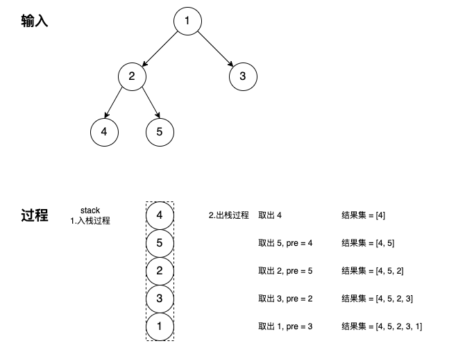

# 二叉树

## 1.什么是二叉树

​	树是一种数据结构，树中的每个节点都包含一个键值和所有子节点的列表，对于二叉树来说，每个节点最多有两个子树结构，分别称为左子树和右子树。


**二叉树的深度**

二叉树的深度是指二叉树的根结点到叶子结点的距离。

最大深度 = 根结点到叶子结点的最大距离

最小深度 = 根结点到叶子结点的最小距离。

常见的问题包括求取二叉树的最大或最小深度，一般可以使用递归算法或者DFS。

参见题目：

- [二叉树的最大深度](./No.104_二叉树的最大深度.md)
- [二叉树的最小深度](./No.111_二叉树的最大深度.md)


## 2.二叉树的遍历

按照 root 节点的访问顺序，可分为前序遍历，中序遍历和后序遍历。其顺序如下：

- 前序遍历：按「根-左-右」依次访问各节点
- 中序遍历：按「左-根-右」依次访问各节点
- 后序遍历：按「左-右-根」依次访问各节点


### 2.1前序遍历

前序遍历指先访问root节点，然后左子树，最后是右子树。

```go
// date 2020/10/19
// 递归版
func preorderTraversal(root *TreeNode) []int {
    if root == nil {
        return []int{}
    }
    res := make([]int, 0, 16)
    res = append(res, root.Val)
    if root.Left != nil {
        res = append(res, preorderTraversal(root.Left)...)
    }
    if root.Right != nil {
        res = append(res, preorderTraversal(root.Right)...)
    }
    return res
}

// 迭代版
// 前序遍历：root->left->right
func preorderTraversal(root *TreeNode) []int {
	res := make([]int, 0, 16)
	if root == nil {
		return res
	}

	stack := make([]*TreeNode, 0, 16)

	for root != nil || len(stack) != 0 {
		// push the left first
		for root != nil {
			res = append(res, root.Val)

			stack = append(stack, root)
			root = root.Left
		}

		// pop the last left one
		if len(stack) != 0 {
			cru = stack[len(stack)-1]
			stack = stack[:len(stack)-1]

			root = cur.Right
		}
	}

	return res
}
```

参见题目：

- [144 二叉树的前序遍历](./No.144_二叉树的前序遍历.md)
- [105 从前序和中序遍历序列构造二叉树](./No.105_从前序和中序序列构造二叉树.md)


### 2.2 中序遍历

中序遍历是指访问左子树，然后root节点，最后是右子树。

```go
// 递归版
func inOrder(root *TreeNode) []int {
  res := make([]int, 0)
  if root == nil { return res }
  // 先访问左子树
  if root.Left != nil {
    res = append(res, inOrder(root.Left)...)
  }
  // 后访问根结点
  res = append(res, root.Val)
  // 最后访问右子树
  if root.Right != nil {
    res = append(res, inOrder(root.Right)...)
  }
  return res
}
```

迭代版的算法前序遍历类似，只是取根节点值加入结果集的时机略有区别。

其主要思路为：

1. 持续检查其左子树，重复1，直到左子树为空【此时栈中保留的是一系列的左子树节点】
2. 出栈一次，并取根节点值加入结果集，然后检查最后一个左子树的右子树，重复1,2

```go
// 迭代版
// 需要stack结构
// left->root->right
func inorderTraversal(root *TreeNode) []int {
    if root == nil {
        return []int{}
    }
    stack := make([]*TreeNode, 0, 16)
    res := make([]int, 0, 16)
    for root != nil || len(stack) != 0 {
		// push all the left node into stack
        for root != nil {
            stack = append(stack, root)
            root = root.Left
        }

		// pop the last one
        if len(stack) != 0 {
            cur = stack[len(stack)-1]
            stack = stack[:len(stack)-1]
            res = append(res, cur.Val)
            root = cur.Right
        }
    }
    return res
}
```

参见题目：

- [94 二叉树的中序遍历](./No.094_二叉树的中序遍历.md)
- [106 从中序和后序遍历序列构造二叉树](./No.106_从中序和后序序列构造二叉树.md)
- [538 把二叉搜索树转换为累加树](./No.538_把二叉搜索树转换为累加树.md)
- [783 二叉搜索树节点最小距离](./No.783_二叉搜索树的节点最小距离.md)

- [098 验证二叉搜索树](./No.098_验证二叉搜索树.md)
- [099 恢复二叉搜索树](./No.099_恢复二叉树.md)


### 2.3 后序遍历

后序遍历是指先访问左子树，然后右子树，最后是root节点。

递归算法：

```go
// date 2020/10/19
// 递归
func postorderTraversal(root *TreeNode) []int {
    if root == nil {
        return []int{}
    }
    res := make([]int, 0, 16)
    if root.Left != nil {
        res = append(res, postorderTraversal(root.Left)...)
    }
    if root.Right != nil {
        res = append(res, postorderTraversal(root.Right)...)
    }
    res = append(res, root.Val)
    return res
}

```

迭代算法：

迭代遍历的时候依然需要 stack 结构来保存已经遍历过的节点；同时借助 pre 指针保存上次出栈的节点，用于判断当前出栈的节点其左右子树是否已经遍历过。

1. 先将根节点入栈，循环遍历栈是否为空
2. 出栈，取出栈顶节点，分支判断：1）是否可以加入结果集；2）继续入栈
   
   分支 1：
   
   - 如果当前节点没有左右子树，则为叶子节点，直接加入结果集
   - 上次出栈的节点 pre 是否为本次出栈节点 cur 的左子树或右子树，如果是，表明 cur 节点的左右子树均处理完毕，可加入结果集
   
   分支 2：
   
   - 非分支 1 的情况，表明当前节点 cur 的左右子树还没有处理完，直接入栈即可；因为是在出栈时机判断结果，所以入栈时先右后左

```go
// 迭代版
// left->right-root
func postorderTraversal(root *TreeNode) []int {
    if root == nil {return nil}
    res := make([]int, 0)
    stack := make([]*TreeNode, 0)
    stack = append(stack, root)
    var pre, cur *TreeNode   // 记录前驱节点和当前节点
    for len(stack) != 0 {
        // 出栈 当前结点
        cur = stack[len(stack)-1]
        // 如果当前结点为叶子结点，则直接加入结果集
        // 如果当前结点不是叶子结点，但是上次遍历结点为当前结点的左右子树时(说明子树已经处理完毕)，也加入结果集
        if cur.Left == nil && cur.Right ==  nil || pre != nil && (pre == cur.Left || pre == cur.Right) {
            res = append(res, cur.Val)
            // 出栈，继续检查
            stack = stack[:len(stack)-1]
            pre = cur
        } else {
            // 因为在出栈的时候检查结点，并追加到结果中
            // 所以，先入栈右子树，后入栈左子树
            if cur.Right != nil {
                stack = append(stack, cur.Right)
            }
            if cur.Left != nil {
                stack = append(stack, cur.Left)
            }
        }
    }
    
    return res
}
```




参见题目：

- [145 二叉树的后序遍历](./No.145_二叉树的后序遍历.md)
- [106 从中序和后序遍历序列构造二叉树](./No.106_从中序和后序序列构造二叉树.md)
- [590 N叉树的后序遍历](./No.590_N叉树的后序遍历.md)


### 2.4 层序遍历

层序遍历是指逐层遍历树的结构，也称为广度优先搜索，算法从一个根节点开始，先访问根节点，然后遍历其相邻的节点，其次遍历它的二级、三级节点。

借助队列数据结构，先入先出的顺序，实现层序遍历。

```go
// date 2020/03/21
// 层序遍历
// bfs广度优先搜索
// 算法一：使用队列，逐层遍历
func levelOrder(root *TreeNode) [][]int {
    if root == nil {
        return [][]int{}
    }
    res := make([][]int, 0, 16)
    queue := make([]*TreeNode, 0, 16)
    queue = append(queue, root)
    for len(queue) != 0 {
        n := len(queue)
        curRes := make([]int, 0, 16)
        for i := 0; i < n; i++ {
            cur := queue[i]
            curRes = append(curRes, cur.Val)
            if cur.Left != nil {
                queue = append(queue, cur.Left)
            }
            if cur.Right != nil {
                queue = append(queue, cur.Right)
            }
        }
        res = append(res, curRes)
        queue = queue[n:]
    }
    return res
}
```

算法2：dfs深度优先搜索

这里的思路类似求二叉树的最大深度，借助dfs搜索，在每一层追加结果。

```go
// date 2020/03/21
func levelOrder(root *TreeNode) [][]int {
    res := make([][]int, 0, 16)
    var dfs func(root *TreeNode, level int)
    dfs = func(root *TreeNode, level int) {
        if root == nil {
            return
        }
        if len(res) == level {
            res = append(res, make([]int, 0, 4))
        }
        res[level] = append(res[level], root.Val)
        level++
        dfs(root.Left, level)
        dfs(root.Right, level)
    }
    dfs(root, 0)
    return res
}
```

**注意**，从上面两种实现的方式来看，层序遍历既可以使用广度优先搜索，也可以使用深度优先搜索。

参见题目

- [102 二叉树的层序遍历](./No.102_二叉树的层序遍历.md)

- [103 二叉树的锯齿形层序遍历](./No.103_二叉树的锯齿形层序遍历.md)

- [107 二叉树的层序遍历2](./No.107_二叉树的层序遍历2.md)

- [199 二叉树的右视图，取层序遍历最后一个节点](./No.199_二叉树的右视图.md)

- [404 左叶子之和](./No.404_左叶子之和.md)

- [515 在每个树行中找最大值](./No.515_在每个树行中找最大值.md)

  

### 2.5 垂序遍历

> 给你二叉树的根结点 root ，请你设计算法计算二叉树的 垂序遍历 序列。
>
> 对位于 (row, col) 的每个结点而言，其左右子结点分别位于 (row + 1, col - 1) 和 (row + 1, col + 1) 。树的根结点位于 (0, 0) 。
>
> 二叉树的 垂序遍历 从最左边的列开始直到最右边的列结束，按列索引每一列上的所有结点，形成一个按出现位置从上到下排序的有序列表。如果同行同列上有多个结点，则按结点的值从小到大进行排序。
>
> 返回二叉树的 垂序遍历 序列。
>

详见题目

- [987二叉树的垂序遍历](./No.987_二叉树的垂序遍历.md)


## 3.递归解决树的问题

递归通常是解决树的相关问题最有效和最常用的方法之一，分为**自顶向下**和**自底向上**两种。

**自顶向下**的解决方案

自顶向下意味着在每个递归层级，需要先计算一些值，然后递归调用并将这些值传递给子节点，视为**前序遍历**。参见题目【二叉树的最大深度】

```go
// 通用的框架，自顶向下
1. return specific value for null node
2. update the answer if needed                      // answer <-- params
3. left_ans = top_down(root.left, left_params)      // left_params <-- root.val, params
4. right_ans = top_down(root.right, right_params)   // right_params <-- root.val, params 
5. return the answer if needed                      // answer <-- left_ans, right_ans
```

参见题目

- No.95—不同的二叉搜索数2，生成所有的二叉搜索数
- No.113—路径总和2，求满足条件的所有路径
- No.129—求根节点到叶子节点数字之和，携带已知内容递归到叶子节点
- No.257—二叉树的所有路径


**自底向上**的解决方案

自底向上意味着在每个递归层级，需要先对子节点递归调用函数，然后根据返回值和根节点本身得到答案，视为**后序遍历**。

```go
// 通用的框架，自底向上
1. return specific value for null node
2. left_ans = bottom_up(root.left)          // call function recursively for left child
3. right_ans = bottom_up(root.right)        // call function recursively for right child
4. return answers                           // answer <-- left_ans, right_ans, root.val
```

参见题目：

- 543—二叉树的直径，求左右深度之和。
- 865—具有所有最深节点的最小子树


**总结**：

当遇到树的问题时，先思考一下两个问题：

> 1.你能确定一些参数，从该节点自身解决出发寻找答案吗？
>
> 2.你可以使用这些参数和节点本身的值来决定什么应该是传递给它子节点的参数吗？

如果答案是肯定的，那么可以尝试使用自顶向下的递归来解决问题。

当然也可以这样思考：

> 对于树中的任意一个节点，如果你知道它子节点的结果，你能计算出该节点的答案吗？

如果答案是肯定的，可以尝试使用自底向上的递归来解决问题。

