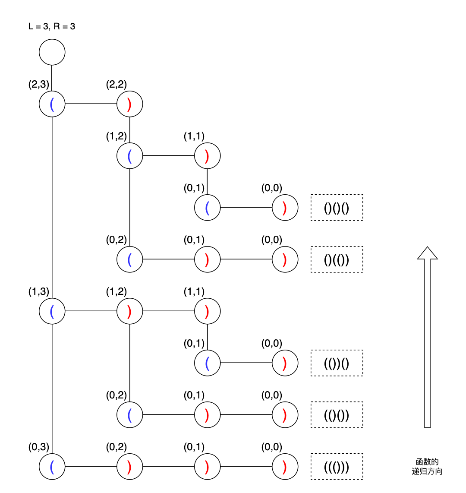

## 22 括号生成-中等

题目：

数字 `n` 代表生成括号的对数，请你设计一个函数，用于能够生成所有可能的并且 **有效的** 括号组合。


> **示例 1：**
>
> ```
> 输入：n = 3
> 输出：["((()))","(()())","(())()","()(())","()()()"]
> ```
>
> **示例 2：**
>
> ```
> 输入：n = 1
> 输出：["()"]
> ```


分析：

这道题并不需要判断括号的匹配问题，因为在 DFS 回溯的过程中，我们可以控制让`(`和`)`成对的匹配上。

具体怎么做呢？

1. 函数的执行顺序，先左后右，即先添加左括号，后添加右括号
2. 添加右括号的时候，左括号的添加个数一定要大于右括号


```go
// date 2023/12/26
func generateParenthesis(n int) []string {
	res := make([]string, 0, 16)

	var dfs func(open, close int, temp string)
	dfs = func(open, close int, temp string) {
		if len(temp) == 2*n {
			res = append(res, temp)
			return
		}
		if open < n {
			dfs(open+1, close, temp+"(")
		}
    // open > close 闭括号只能补在一个开括号后面
		if open > close {
			dfs(open, close+1, temp+")")
		}
	}

	dfs(0, 0, "")

	return res
}
```

