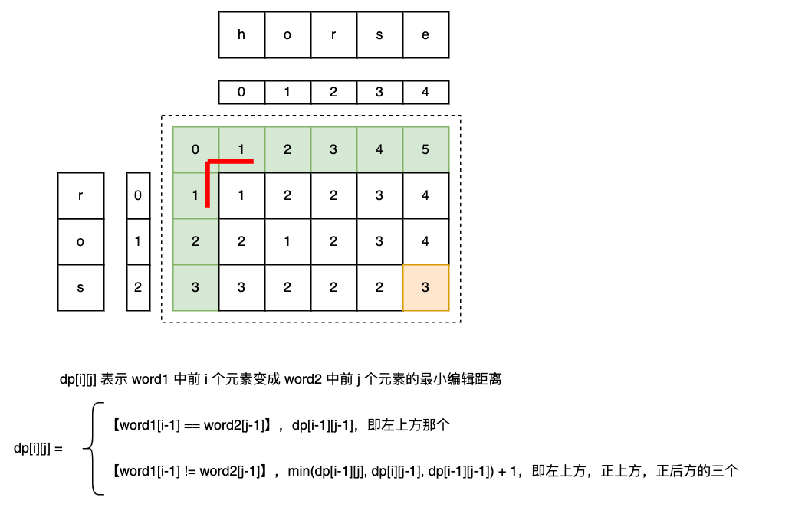

## 72 编辑距离-中等

题目：

给你两个单词 word1 和 word2， 请返回将 word1 转换成 word2 所使用的最少操作数  。

你可以对一个单词进行如下三种操作：

插入一个字符

删除一个字符

替换一个字符


分析：

```go
// date 2023/11/07
func minDistance(word1 string, word2 string) int {
    m, n := len(word1), len(word2)
    dp := make([][]int, m+1)
    // dp[i][j] 表示将 word1[0...i-1] 变成 word2[0...j-1] 所需要的最小编辑数
    for i := 0; i <= m; i++ {
        dp[i] = make([]int, n+1)
        dp[i][0] = i  // j = 0, word2 is empty, delete all word1 elem
    }
    for j := 0; j <= n; j++ {
        dp[0][j] = j  // i = 0, word1 is empty, insert all elem to word1
    }

    for i := 1; i <= m; i++ {
        for j := 1; j <= n; j++ {
            if word1[i-1] == word2[j-1] {
                dp[i][j] = dp[i-1][j-1]
            } else {
                dp[i][j] = min(min(dp[i-1][j], dp[i][j-1]), dp[i-1][j-1]) + 1
                // dp[i-1][j] delete 1 elem in word1
                // dp[i][j-1] insert 1 elem to word2 等价于从 word1 删除 1 个
                // dp[i-1][j-1] replace 1 elem of word1
            }
        }
    }

    return dp[m][n]
}

// word1[0...i-1] -> word2[0....j] = dp[i-1][j]
// word1[0.....i] -> word2[0....j] = dp[i][j]
// 在 dp[i-1][j] 已知的情况下，word1 中 删除 word1[i] 即可
// dp[i][j] = dp[i-1][j], delete 1 elem of word1

func min(x, y int) int {
    if x < y {
        return x
    }
    return y
}
```




空间优化（滚动数组压缩到一维，空间 O(n)）：

`dp[i][j]` 依赖三个邻居：上方 `dp[i-1][j]`、左方 `dp[i][j-1]`、**左上角** `dp[i-1][j-1]`。前两个用一维数组滚动时很好处理（和 No.064 同理：`dp[j]` 更新前是上方值，`dp[j-1]` 更新后是左方值）。但**左上角 `dp[i-1][j-1]` 会在 `dp[j-1]` 被覆盖后丢失**，必须额外用一个变量 `prev` 在覆盖前把它存下来——这是编辑距离滚动数组与最小路径和的关键区别。

```go
// date 2026/06/20
func minDistance1D(word1 string, word2 string) int {
    m, n := len(word1), len(word2)
    dp := make([]int, n+1)
    for j := 0; j <= n; j++ { // 第 0 行：word1 为空，需插入 j 个字符
        dp[j] = j
    }

    for i := 1; i <= m; i++ {
        prev := dp[0] // dp[i-1][j-1]，初始为上一行第 0 列
        dp[0] = i     // 第 0 列：word2 为空，需删光 word1 前 i 个字符
        for j := 1; j <= n; j++ {
            temp := dp[j] // 更新前的 dp[j] = 上一行 dp[i-1][j]（上方值），先存下来
            if word1[i-1] == word2[j-1] {
                dp[j] = prev // 相等，直接继承左上角，无需操作
            } else {
                dp[j] = min(dp[j], dp[j-1], prev) + 1
                //         ↑        ↑          ↑
                //       上方      左方      左上方
                //  dp[j]    本行未覆盖 → 上一行 dp[i-1][j]
                //  dp[j-1]  本行已覆盖 → 本行   dp[i][j-1]
                //  prev     上一行左上 dp[i-1][j-1]
            }
            prev = temp // 本轮旧 dp[j] 成为下一列 (j+1) 的左上角
        }
    }
    return dp[n]
}
```

> `min` 用 Go 1.21+ 内置函数即可（支持多参数）；旧版本需自行定义。

复杂度：时间 O(m·n)，空间 O(n)。
